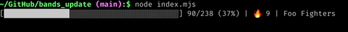
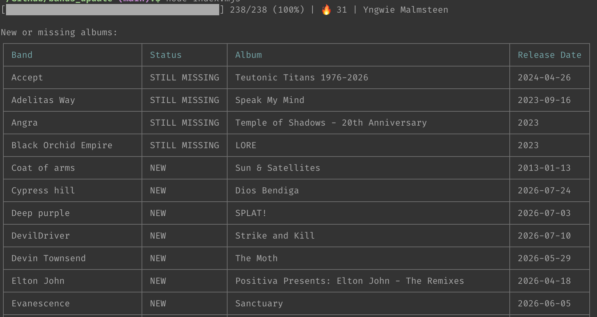

<div align="center">
    
    <figcaption>
        Image credits:
        <a href="https://unsplash.com/illustrations/two-electric-guitars-crossed-over-each-other-X0IJ_n37ILo">
            Public domain vectors
        </a>
    </figcaption>
    <hr>
    <h2>Bands check</h2>
    <p>
    Script for checking new album releases of <a href="checks.json">specific bands</a> through 
    <a href="https://musicbrainz.org/doc/MusicBrainz_API">MusicBrainz API</a>.
    </p>
</div>

### Instructions

Just run `node index.mjs` or `npm start`. The process will start querying MusicBrainz at a pace of one request 
every 1500ms for respecting their [rate limiting](https://musicbrainz.org/doc/MusicBrainz_API/Rate_Limiting).



The process bar will show you:
* total processed bands
* total bands to process
* bands for which there's a new album (beside the flame)
* band's name currently queried

At the end it will be printed a summary of the new albums found and the [checks.json](checks.json) file will be updated. 



If the scripts aborts for too many consecutive network errors, then the [checks.json](checks.json) file will be updated the same
and then the script will exit.

### JSON schema

`checks.json` is validated against [`checks.schema.json`](checks.schema.json)
(JSON Schema Draft 7). Required fields per band:

| Field | Type | Description |
|-------|------|-------------|
| `last_album` | string | Title of the last known studio album |
| `last_album_release_date` | string | `YYYY`, `YYYY-MM`, or `YYYY-MM-DD` |
| `last_check` | string | `YYYY-MM-DD` — set to `1970-01-01` to force a check |
| `musicbrainz_id` | string (UUID) | MusicBrainz artist MBID — must be unique |
| `discography_url` | URI | Wikipedia discography URL — must be unique |

Optional fields set by the script:

| Field | Type | Description |
|-------|------|-------------|
| `missing` | string | Newer album title detected by MB |
| `upcoming` | object or `true` | `{ album_name, release_date }` for future releases |
| `exclude` | string[] | Album titles to ignore (e.g. mis-tagged compilations) |

#### Validating the schema

```bash
npx ajv-cli validate -s checks.schema.json -d checks.json
```

A passing run prints `checks.json valid`. Errors list every field that fails
with its JSON pointer (`/BandName/fieldName`) and the violated constraint.

#### VS Code integration

Add `"$schema": "./checks.schema.json"` as the first key in `checks.json` to
get inline validation, hover docs, and autocomplete directly in the editor.
Remove it before committing (the script does not expect that key).

